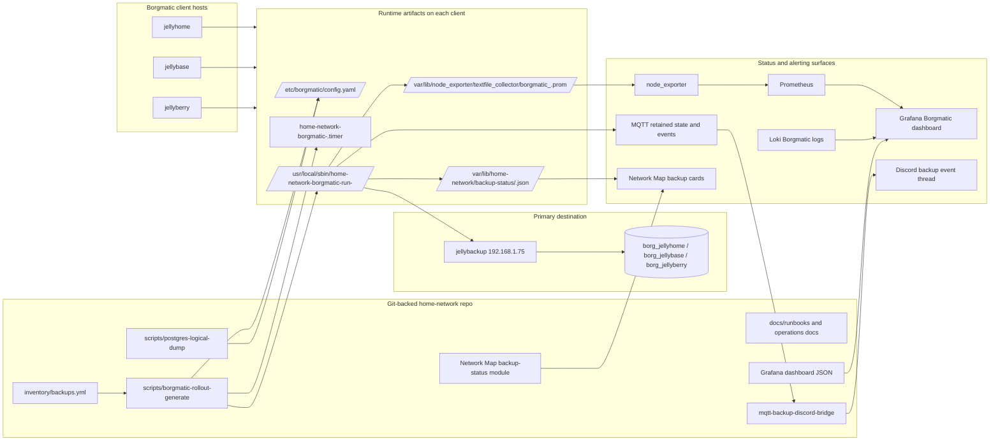
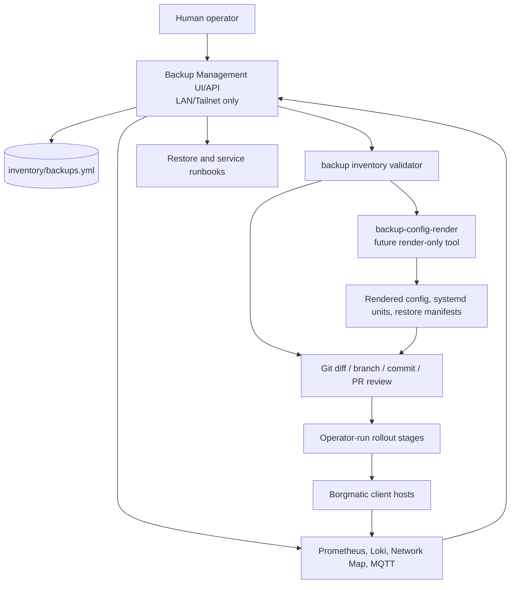
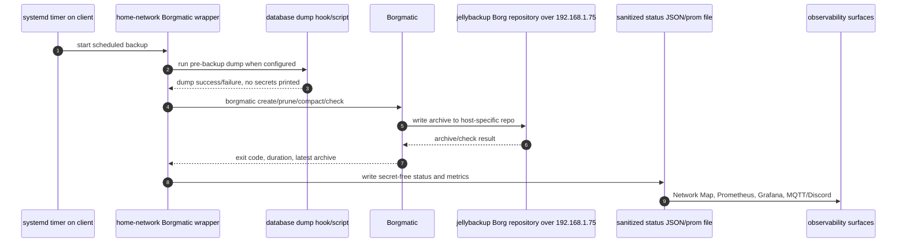
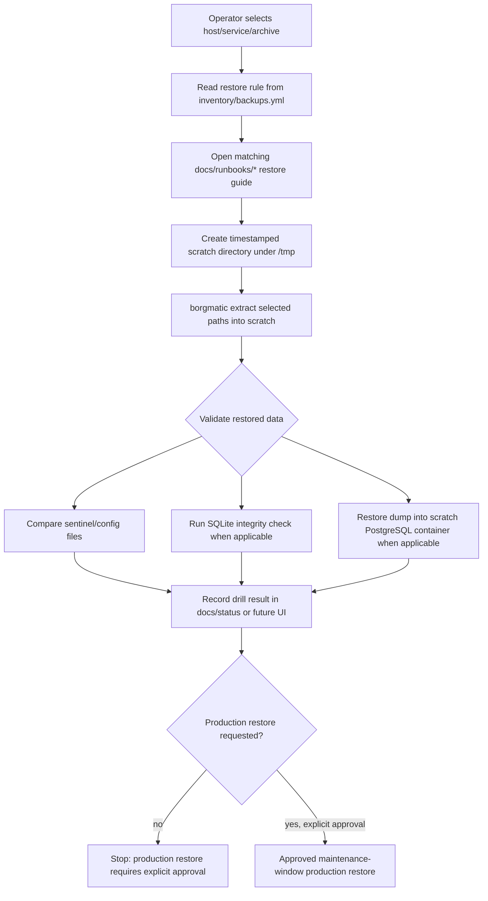
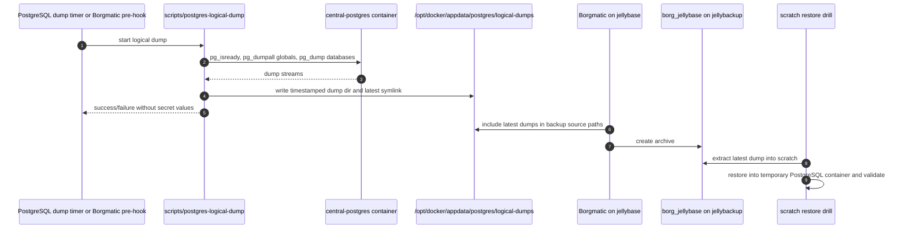
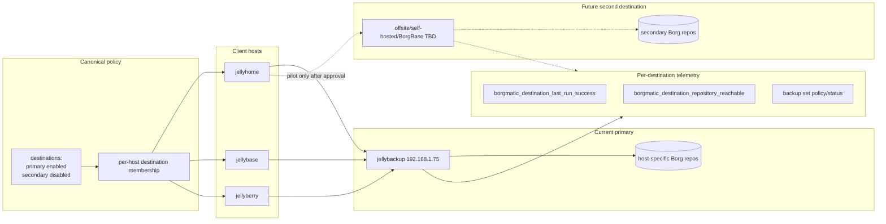

# Consolidated Borg Management Architecture

Status: phase 0 current-state audit and target architecture
Last updated: 2026-06-01

## Scope

This document describes the current and target backup-management architecture for the `home-network` platform. It is intentionally documentation-only: no live services, privileged config, Borg repositories, timers, or secrets were changed while producing it.

Primary goals:

- keep Borgmatic as the execution layer;
- keep `inventory/backups.yml` as the canonical policy source;
- expose non-secret backup status to operators through existing observability surfaces;
- add a future management plane that proposes reviewed Git changes rather than mutating live hosts directly;
- make restore drills safe by default;
- prepare for a second backup destination without changing current production behavior.

## Current state summary

Repository sources of truth and runtime-facing artifacts:

- `inventory/backups.yml` defines backup classes, restore rules, primary destination metadata, enabled hosts, important paths, rollout status, Loki settings, MQTT settings, and host repository paths.
- `scripts/borgmatic-rollout-generate` renders guarded, host-specific rollout stages from `inventory/backups.yml`.
- Generated stages install or use:
  - `/etc/borgmatic/config.yaml` on each client host;
  - `/usr/local/sbin/home-network-borgmatic-run-<host>`;
  - `home-network-borgmatic-<host>.service` and `.timer`;
  - `/var/lib/home-network/backup-status/<host>.json`;
  - `/var/lib/node_exporter/textfile_collector/borgmatic_<host>.prom`;
  - optional MQTT retained state and event topics.
- `scripts/postgres-logical-dump` creates central PostgreSQL logical dumps under `/opt/docker/appdata/postgres/logical-dumps` without printing secrets.
- `docker/appdata/network-map/site/modules/backup-status.js` renders Borgmatic status cards from collected backup telemetry.
- `docker/appdata/grafana-provisioning/dashboards/json/borgmatic-backups.json` provisions the Grafana dashboard for backup telemetry/logs.
- `scripts/mqtt-backup-discord-bridge` and `systemd/mqtt-backup-discord-bridge.service` bridge backup MQTT events into Discord.

Known current hosts from `inventory/backups.yml`:

| Host | Role | Borg enabled | Repository path |
|---|---:|---:|---|
| `jellyhome` | primary Docker/dev host | yes | `/home/jellybackup/externaldisk/borg_jellyhome` |
| `jellybase` | secondary monitoring host | yes | `/home/jellybackup/externaldisk/borg_jellybase` |
| `jellyberry` | Raspberry Pi lightweight node | yes | `/home/jellybackup/externaldisk/borg_jellyberry` |
| `seedbox` | remote sync/backup helper | yes | not yet recorded |

Current primary destination:

- host: `jellybackup`
- LAN IP: `192.168.1.75`
- SSH user: `jellybackup`
- address policy: use LAN IP, not FQDN/MagicDNS, to avoid routing heavy backup traffic over Tailscale and overloading the backup Pi.

Current local runtime evidence gathered non-destructively from this host only (`jellyberry`); other hosts were described from repository inventory/docs, not live-inspected during this phase 0 doc pass:

- `/var/lib/home-network/backup-status/jellyberry.json` exists and reports a successful backup with exit code `0`, latest archive `jellyberry-2026-06-01T03:02:41`, and repository reachability `true`.
- `home-network-borgmatic-jellyberry.timer` is enabled and scheduled for the next run.
- The stock `borgmatic.timer` is disabled, while the managed host-specific timer is enabled.

## Current state architecture

## Target control plane

The target control plane is a thin internal GitOps layer. It reads policy and telemetry, validates requested changes, renders diffs/artifacts, and leaves privileged host changes to explicit operator-reviewed rollout stages.

Design rules:

- `inventory/backups.yml` remains canonical.
- The UI/API must not store Borg passphrases, exported repo keys, SSH private keys, database passwords, or raw Borg logs.
- Early write actions create a patch, branch, commit, or rollout artifact; they do not silently mutate `/etc/borgmatic/config.yaml` or run production restores.
- Production restores remain maintenance-window operations with explicit approval.
- The UI is LAN/Tailnet-only.

## Backup data flows

Borgmatic remains the execution engine on each client. Client hosts initiate SSH connections to the primary destination over the LAN IP. Root-owned wrappers write only sanitized status for non-root consumers.

Current primary data paths:

- Docker/runtime source paths such as `/opt/docker` and service appdata are backed up from each client host.
- Central PostgreSQL logical dumps are written under `/opt/docker/appdata/postgres/logical-dumps` and should be included in Borg source paths for `jellybase`.
- Borg repositories live on `jellybackup` under host-specific paths in `/home/jellybackup/externaldisk/`.

## Restore-drill flow

Restore drills default to scratch extraction. They should prove that archives are readable and application-level data can be validated without writing into production paths.

Safety boundaries:

- Scratch restores should refuse production-looking destinations by default, including `/`, `/opt/docker`, `/home/jellyfish/media`, live appdata paths, and database data directories.
- Secrets are recreated from host-local secret stores or a password manager, not restored from Git, Discord, or UI logs.
- Production restores require stopping affected services, taking a pre-restore local snapshot/dump, replacing data, redeploying from Git, verifying health, and retaining rollback artifacts until a later successful backup cycle.

## Database dump flow

The current central PostgreSQL dump script is separate from Borgmatic scheduling. The target model makes logical dumps first-class backup sets and eventually runs them as pre-backup dependencies.

Target dump policy:

- A fresh logical dump should be required for critical PostgreSQL-backed services.
- Dump failures should fail the backup loudly rather than creating misleading archives with stale database dumps.
- Dump freshness/status should become telemetry alongside Borgmatic backup status.
- Scratch restore drills should validate logical dumps in temporary PostgreSQL containers.

## Future second destination

The repository should model a disabled secondary destination before it is used. Borgmatic supports multiple repositories, but rollout must be careful because prune/check/compact behavior, bandwidth, and failure modes become per-destination concerns.

Recommended rollout order:

1. Add disabled secondary destination metadata to inventory.
2. Render configs with only primary active.
3. Enable secondary for one low-risk host.
4. Verify create/list/check/prune/compact behavior.
5. Add per-destination telemetry labels.
6. Roll out host by host.

## Phase 0 findings and gaps

Findings:

- The current foundation already covers Borgmatic rollout generation, host-specific repositories, sanitized status JSON, Prometheus textfile metrics, Loki, Grafana, MQTT events, Discord bridging, and Network Map cards.
- Current policy still uses host-level `important_paths`; it does not yet have first-class backup sets, destinations, database dump dependencies, or per-service restore metadata.
- The current PostgreSQL logical dump flow exists but is not yet fully integrated as a Borgmatic pre-backup dependency.
- The management plane does not exist yet; current human workflows rely on docs, inventory edits, generated scripts, Grafana/Network Map status, and manual runbooks.
- `seedbox` is marked `borg_enabled: true` but lacks a repository path, so current generator behavior should skip it until its destination and source policy are finalized.

Gaps to close in later phases:

- formal schema for destinations, backup sets, service ownership, database dump hooks, restore validators, and secondary destination settings;
- render-only Borgmatic config/systemd artifacts for diff review;
- validator coverage for dump paths, disabled secondary destinations, restore rules, and unsafe paths;
- read-only management UI/API that combines inventory and telemetry;
- controlled patch/branch workflow for operator-requested path changes;
- scratch restore-drill automation with safe destination refusal.

## Security and privacy constraints

Never commit or expose:

- Borg passphrases;
- exported Borg repository keys;
- SSH private keys;
- database passwords;
- raw `.env` contents;
- raw Borg/Borgmatic logs containing sensitive file listings;
- MQTT credentials.

Safe-to-display status should stay limited to host names, success/failure, timestamps, durations, exit codes, archive names, and coarse repository reachability.
