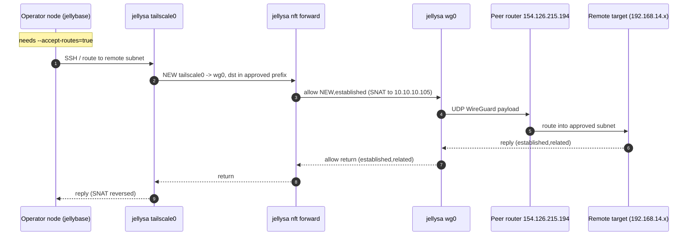
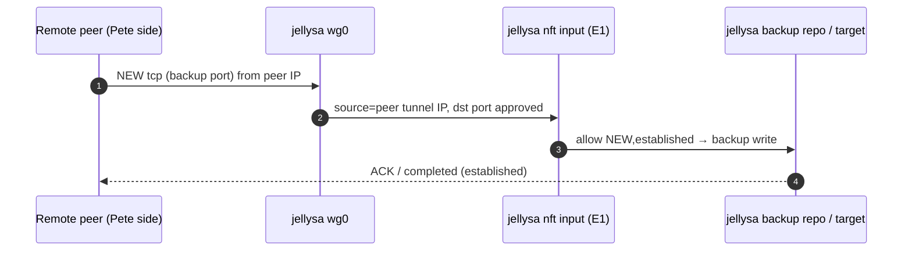

# jellysa Remote-Subnet Routing — Architecture, Traffic Flow & Configuration Reference

**Status:** Reference document (derived from plan `docs/plans/018-jellysa-tailscale-wireguard-routing.md`).
**Scope:** How `jellysa` (South Africa Raspberry Pi 4, tailnet `100.120.89.41`) routes between our tailnet and nine remote subnets over a parallel `wg0` WireGuard tunnel — plus the **evolution path** where remote sites route back to us and we act as a **backup destination**.
**Intended readership:** Operator + remote-side peer (Pete / Pieter) — to align on architecture, traffic direction, and config before any live change.

> ⚠️ This is documentation of **intent and templates**. Nothing here has been executed against any live host beyond the read-only Stage 0 preflight described in §Preflight. Every command is a template pending operator approval.

---

## 1. Purpose

`jellysa` gets a second, fail-safe network path: `tailscale0` (primary, our tailnet) and `wg0` (WireGuard) run in parallel. `jellysa` advertises **only nine approved remote routes** into our tailnet. Access is **one-way by default**: our tailnet reaches approved remote destinations; remote sites cannot originate into our tailnet. The design is **fail-closed** — losing Tailscale must not strand access, and losing/misconfiguring WireGuard must be immediately revertible.

## 2. Components & addresses

| Thing | Value |
| --- | --- |
| `jellysa` WireGuard tunnel address | `10.10.10.105/32` |
| Piet's MikroTik WireGuard interface | `WG-Rhenosterfontein`, `10.10.10.11/24`, MTU `1420` |
| Remote WireGuard endpoint (UDP) | `154.126.215.194:13231` (Piet's PPPoE WAN) |
| MikroTik interface public key | `h7zAUZaAvBpypPUlvKfuaLAdegfuFCMigp16Y7W7nGI=` (public, not secret; verified from RouterOS) |
| MikroTik RouterOS / WAN MTU | RouterOS `7.24.1`; PPPoE actual MTU `1480` |
| jellysa private/public key state | **Generate a fresh keypair on jellysa.** No matching private key has been verified on jellysa. Replace only `Dom.public-key` with the newly generated jellysa public key. |
| MikroTik peer policy for `Dom` | `allowed-address=10.10.10.105/32`, `persistent-keepalive=25s` (verified; no handshake yet) |
| jellysa tailnet IP | `100.120.89.41` |
| Operator/verifying tailnet nodes | `jellyberry 100.68.81.120`, `jellybase 100.125.86.118`, `jellyhome 100.90.175.59` |
| jellysa LAN | `10.0.0.21/24`, default via `10.0.0.2` (ordinary default route — WG endpoint must keep using it) |

### Approved remote subnets (nine)
| Subnet | Site | Verified route from Piet's MikroTik |
| --- | --- | --- |
| `192.168.11.0/24`, `192.168.21.0/24` | Andrews Farm | directly connected on `bridge1` |
| `192.168.31.0/24` | Andrews Farm | next hop `192.168.21.254` via `bridge1` |
| `192.168.12.0/24`, `192.168.22.0/24` | Pieter / Rietfontein side | onward via `WG-Rhenosterfontein` |
| `192.168.13.0/24`, `192.168.23.0/24`, `192.168.33.0/24` | Other chicken farm | onward via `WG-Rhenosterfontein` |
| `192.168.14.0/24` | Lodge | onward via `WG-Rhenosterfontein` |

Piet's router also has routes for `192.168.15.0/24`, `192.168.19.0/24`, `192.168.100.0/24`, and `192.168.151.0/24`. These are **out of scope and must not be added** unless a later plan explicitly approves them. In particular, an existing route is not permission to advertise it into our tailnet.

Overlap check (first pass): none of the approved 1x/2x/3x subnets collide with our LAN `192.168.1.0/24`, tailnet CGNAT `100.64.0.0/10`, or jellysa LAN `10.0.0.0/24`. **Programmatic check is still a preflight gate.**

## 3. Architecture

```mermaid
graph TB
  subgraph OUR_TAILNET["Our tailnet (control initiator)"]
    jh[("jellyhome 100.90.175.59")]
    jb[("jellybase 100.125.86.118")]
    jbr[("jellyberry 100.68.81.120")]
  end

  subgraph JSA["jellysa — South Africa Pi 4"]
    TS[("tailscale0 100.120.89.41")]
    WG[("wg0 10.10.10.105/32")]
    FW["stateful nft forward rules<br/>(fail-closed)"]
    TS --- FW --- WG
  end

  subgraph REMOTE["Piet's routed network behind MikroTik WG hub"]
    R1["Direct on bridge1<br/>192.168.11/21.0/24"]
    R31["via 192.168.21.254<br/>192.168.31.0/24"]
    R2["Onward WG peers<br/>192.168.12/22.0/24"]
    R3["Onward WG peers<br/>192.168.13/23/33.0/24"]
    R4["Onward WG peer<br/>192.168.14.0/24"]
    Peer(("Piet's MikroTik hub<br/>WG-Rhenosterfontein<br/>10.10.10.11/24<br/>154.126.215.194:13231"))
  end

  OUR_TAILNET <--TS--> TS
  jh -.->|"verify routes"| TS
  WG <--UDP WG--> Peer
  Peer --- R1 & R31 & R2 & R3 & R4

  classDef tailnet fill:rgba(8,51,68,.4),stroke:#22d3ee;
  classDef host fill:rgba(76,29,149,.4),stroke:#a78bfa;
  classDef remote fill:rgba(120,53,15,.3),stroke:#fbbf24;
  class TS,WG,FW host;
  class jh,jb,jbr tailnet;
  class R1,R2,R3,R4,Peer remote;
```

**Direction rule (phase 1):** NEW traffic is initiated only from our tailnet toward the nine approved remote prefixes. Return traffic is `established,related`. Remote-originated NEW traffic is dropped (see evolution §7 for the deliberate exception).

### Live baseline (Stage 0 preflight, read-only — captured 2026-09-01)
- `jellysa` tailscale prefs: `AdvertiseRoutes=['0.0.0.0/0','::/0']` (exit-node **configured but dormant/unapproved** — peer shows `ExitNodeOption:false`), `RunSSH:true`, `RouteAll:false`, `NetfilterMode:2`.
- Forwarding: `net.ipv4.ip_forward=1` (from `/etc/sysctl.d/99-tailscale-exit-node.conf`); `rp_filter` all=0, per-iface **2 (loose)**.
- Firewall backend: **nftables / iptables-nft**. Active **Tailscale-managed** `ts-input`/`ts-forward` chains in `table ip filter`/`nat`; `FORWARD` policy `ACCEPT`. No `wg0` rules exist.
- WireGuard: kernel module `wireguard.ko` **available but not loaded**; **`wg-quick`/`wg` userspace tools NOT installed**; `/etc/wireguard/` absent.
- Access paths: (1) Tailscale SSH as `jellyfish`; (2) operator-confirmed
  independent recovery by remotely controlling a non-Tailscale machine on the
  South Africa LAN, then using LAN SSH/sudo to jellysa at `10.0.0.21`. Re-test
  both immediately before risky mutations.
- **Gap:** operator nodes have `--accept-routes=false` (§6 blocker).

## 4. Traffic flow — phase 1 (one-way subnet routing)



**Blocked (phase 1):** any NEW `wg0 → tailscale0` flow; remote-originated connections into our tailnet; any default route / `0.0.0.0/0` from wg0.

## 5. Configuration templates

### 5.1 `wg0.conf` — `/etc/wireguard/wg0.conf` (`chmod 600 root:root`)
```ini
[Interface]
Address = 10.10.10.105/32
PrivateKey = <JELLYSA_WG_PRIVATE_KEY_PLACEHOLDER>   # obtain out-of-band, never commit
MTU = 1420                                           # lower only after PMTU test

[Peer]
PublicKey = h7zAUZaAvBpypPUlvKfuaLAdegfuFCMigp16Y7W7nGI=
Endpoint = 154.126.215.194:13231
PersistentKeepalive = 25                             # NAT-safe default
# Handshake-only baseline. Add a peer-confirmed remote test host /32 in Stage 5.
AllowedIPs = 10.10.10.11/32
```

### 5.2 Forwarding scope — `/etc/sysctl.d/99-jellysa-wg-routing.conf` (preserve existing exit-node value)
```ini
net.ipv4.ip_forward = 1
# if strict rp_filter breaks the asymmetric path, loosen per-interface only:
# net.ipv4.conf.wg0.rp_filter = 2
```
Do **not** set `ip_forward=0` — the existing Tailscale exit-node role and subnet routing both need it.

### 5.3 Stateful fail-closed ruleset — **candidate**, separate nft table (NOT Tailscale's managed tables)
> Backend is nftables (iptables-nft). Tailscale owns `table ip filter`/`nat` (warns "do not touch"). Put wg rules in a **new** table `inet jw` and ensure its input/forward hooks run **before** Tailscale's chains. Piet's MikroTik currently permits broad NEW forwarding from `10.10.10.0/24` through its WireGuard interface, so jellysa must protect both local services (**INPUT**) and the tailnet (**FORWARD**). Validate with `nft --check`, apply atomically under an armed rollback watchdog, and make the ruleset persist through `nftables.service` **before** enabling `wg-quick@wg0.service`. Verify the live hook order and external Tailscale SSH before proceeding. This remains a template.

```
#!/usr/sbin/nft -f
table inet jw {
  # Initially empty. Stage 5 adds only the current cumulative proven prefixes,
  # atomically updating both the live set and its persisted source.
  set enabled_prefixes { type ipv4_addr; flags interval; }

  chain input { type filter hook input priority filter - 1; policy accept;
    # WireGuard's encrypted UDP transport arrives on the ordinary WAN path;
    # these rules govern only decrypted packets emerging from wg0.
    iifname "wg0" ct state established,related accept
    # evolution §7: a deliberate inbound backup exception goes before this drop.
    iifname "wg0" drop
  }

  chain forward { type filter hook forward priority filter - 1; policy accept;
    # Return traffic only toward tailscale0 for flows initiated there.
    iifname "wg0" oifname "tailscale0" ct state established,related accept
    # Phase 1: no NEW traffic may originate from any MikroTik-side WG peer.
    iifname "wg0" drop

    # Only tailscale0 may initiate toward approved remote prefixes.
    iifname "tailscale0" oifname "wg0" ip daddr @enabled_prefixes ct state new,established accept
    oifname "wg0" drop
  }
}
```

Enforce the ordering instead of relying on incidental target timing:

```ini
# /etc/systemd/system/wg-quick@wg0.service.d/10-nftables-first.conf
[Unit]
Requires=nftables.service
After=nftables.service
```

Run `systemctl daemon-reload`; enable `nftables.service` and
`wg-quick@wg0.service`; then verify `Requires=` and `After=` with
`systemctl show`. Start `wg0` through the selected service so the persistent
and tested path are the same. Rollback must restore prior enablement state.

### 5.4 Tailscale advertisement — cumulative, one route at a time
```bash
# First route only. Preserve the existing exit-node capability explicitly.
sudo tailscale set \
  --advertise-routes=192.168.14.0/24 \
  --advertise-exit-node=true
sudo tailscale debug prefs
```
For each subsequent route, pass the **complete cumulative proven list** to
`--advertise-routes`; the flag replaces rather than appends to the advertised
route list. Never advertise all nine initially. Install the restrictive ACL/
grant policy before approving the first route in the admin console. Advertising,
admin approval, and ACL/grant policy are separate gates.

## 6. Precondition gaps (must close before live use)

| Gap | Detail | Fix (mutation, needs approval) |
| --- | --- | --- |
| **accept-routes OFF on operator nodes** | `RouteAll:false` on jellyberry, jellybase, jellyhome → the 9 routes won't install on any verifier | `sudo tailscale set --accept-routes=true` per node — read §6.1 first (jellyhome LAN-overlap prerequisite) |
| WG userspace tools missing | `wg`/`wg-quick` not installed; kernel module unloaded | `apt install wireguard-tools` + `modprobe wireguard` (make persistent) on jellysa |
| Root-gated reads | prefs/ruleset needed interactive sudo | solved via stored `SUDO_PASSWORD_JELLYSA` (read-only use) |
| jellysa key ownership | MikroTik already has a `Dom` peer public key, but no matching jellysa private key has been verified | Generate a fresh keypair on jellysa and have Piet replace only `Dom.public-key`; never invent/reuse a key without its private half |
| First safe test target | No approved concrete target IP supplied yet | Piet to nominate one host, ideally inside `192.168.14.0/24`; handshake itself is verified with `wg show` before sending payload |
| Remote DNS | Not supplied | Use IP-only tests for phase 1; DNS remains optional/later |

### 6.1 accept-routes vs the home-LAN advertisement (verified pitfall — read before flipping)

**jellyhome advertises its LAN `192.168.1.0/24` into the tailnet as a subnet router.** This is the path that lets **off-LAN clients — e.g. your laptop on the road — reach home-network devices such as `192.168.1.254`**. Keep this advertisement; **do not remove it**, or road access to the LAN breaks.

The 9 remote subnets do **not** overlap the LAN (all `192.168.1x/2x/3x` / `192.168.14.0/24`), so accepting them is never the problem. The only collision is jellyhome's *own* LAN advertisement against hosts that sit on that LAN:

- **Off-LAN clients (laptop/phone on the road):** `--accept-routes=true` installs `192.168.1.0/24 via jellyhome` plus jellysa's 9 remote routes — clean, no overlap. Just enable “Use Tailscale subnets” in the Tailscale app.
- **Hosts physically on the LAN (jellyberry `192.168.1.159`, jellybase `192.168.1.2`):** enabling `accept-routes` makes Tailscale install `192.168.1.0/24` into **table 52**, whose policy rule (`from all lookup 52`, pref 5270) runs **before** `main` — so LAN traffic starts routing via `tailscale0` despite the on-link `eth0` route, breaking local LAN. **Verified live 2026-09-01; recorded as a pitfall in the `home-network-operations` skill.**

Correct reconciliation (choose A or B):

- **(A) Keep the LAN advertisement + targeted on-link rule on LAN members.** Enable `accept-routes` on any LAN-member node that must consume remote routes, and add a durable higher-priority rule so the local LAN still resolves via `main` before table 52:
  ```bash
  sudo ip rule add to 192.168.1.0/24 lookup main pref 5260   # 5260 < 5270 (Tailscale table 52)
  ```
  Persist with a small systemd `networkd`/`if-up` unit. Remote subnets are unaffected.
- **(B) Leave LAN members untouched; verify from an off-LAN node.** Only nodes that genuinely consume remote routes get `--accept-routes=true`; during route-by-route rollout verify reachability from an off-LAN device (e.g. the road laptop) rather than jellybase/jellyberry.

Rollout must stay rollback-first: snapshot prefs → enable on ONE node → check `ip route show table 52` + `ip route get 192.168.1.2` + ping LAN → `sudo tailscale set --accept-routes=false` immediately if LAN routing broke, before touching any other node.

## 7. EVOLUTION — remote sites route back to us (we become a backup destination)

**Goal (Pete/Pieter + sites):** let remote sites **initiate** connectivity toward our side so they can push backups **to us**. This deliberately creates an inbound exception that phase 1 blocks, so it is a **separate, explicitly-gated phase** with its own narrow rules. It must never reopen general tailnet access.

### 7.1 Two evolution options

- **E1 (recommended, most fail-closed): remote backs up to jellysa itself.**
  Peer's wg0 config gains an `AllowedIPs` entry for `10.10.10.105/32` (jellysa's tunnel) → remote reaches jellysa directly. jellysa hosts a backup repo (Borg/Restic). Only an **INPUT** rule on jellysa changes — introduced EARLIER than `ts-input`: **allow NEW** `tcp dport <backup-port>` from the peer tunnel IP; **drop everything else from `wg0`**. No tailnet exposure at all.
  ```text
  chain jw-input { type filter hook input priority filter - 1; policy accept;
    iifname "wg0" ip saddr <PEER_TUNNEL_IP> tcp dport @backup_ports ct state new,established accept
    iifname "wg0" drop
  }
  ```
- **E2 (future/complex): remote → chosen backup target on our tailnet (e.g. jellybackup `100.116.9.17`).**
  jellysa must NAT-forward `wg0 → tailnet0` to a single destination host:port, with source pinned to the peer and a dedicated backup port. Tighter blast radius, but it does expose one path into the tailnet — only for an approved host:port pair, with everything else dropped. Must be designed + reviewed as its own sub-plan.

### 7.2 Behaviour once E1/E2 is enabled

**Guardrail:** peer stays on its tunnel IP; only the approved backup port is open; `wg0` cannot reach any other jellysa service or any tailnet node; all existing fail-closed wg forward rules remain.

### 7.3 Direction summary

| Phase | Allowed NEW | Allowed return | Blocked |
| --- | --- | --- | --- |
| 1 — today | tailnet → approved remote prefixes | established,related | wg0→anything NEW; remote→tailnet |
| 2 — evolution | + peer → jellysa backup port (or → one tailnet target host:port) | established,related | everything else from wg0 |

## 8. Gates before any mutation (unchanged from plan 018)
- Two independent access paths to jellysa verified **or** on-site recovery confirmed, at the moment of mutation.
- Backup/rollback artifacts captured + verified (`.conf`, sysctl, prefs snapshot, firewall ruleset, `rollback.sh`).
- Rollback watchdog armed before change, cancelled only after **external** verification from another tailnet node.
- Route-by-route rollout; never all nine at once.
- Reboot test only after explicit approval.
- Plan status flips `planned → live` only by an authorized operator with evidence attached.

## 9. Related documents
- `docs/plans/018-jellysa-tailscale-wireguard-routing.md` — the source plan (status: planned; Stage 0 preflight evidence per §3 here).
- `docs/plans/016-jellysa-and-jellybackup-onboarding.md` — jellysa onboarding / exit-node sysctl precedent.
- `docs/specs/007-*.md` — UFW/firewall policy ("don't enable a firewall without a verified backdoor + host plan").
- `docs/operations/seedit4me-reverse-tunnel.md` — two-path precedent.