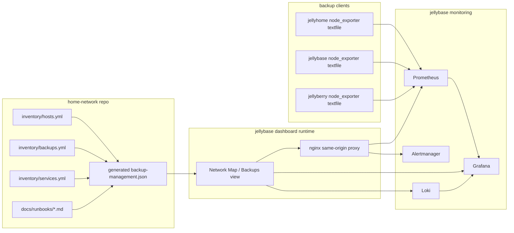

# Spec 006 — Read-only Backup Management UI/API

Status: design only; not deployed
Created: 2026-06-01
Owner: home-network operators

## Goal

Design a read-only Backup Management surface that helps an operator answer: what is backed up, is it healthy, where are the runbooks, and what should I check next?

The first version must not mutate live systems. It can be a dedicated page inside Network Map on `jellybase`, or a small adjacent static app served by the same nginx/proxy pattern. The recommended first implementation is a Network Map "Backups" view because the dashboard already runs on `jellybase`, already proxies Prometheus and Alertmanager, and already presents host/service inventory.

## Progress checklist

- [x] Define read-only UI scope and non-goals.
- [x] Define UI panels, API shape, and data-source mapping.
- [x] Define architecture/wireframe and security boundary.
- [x] Define beginner-friendly implementation guide.
- [ ] Implement the read-only API/static data collector.
- [ ] Implement the Network Map Backups view.
- [ ] Verify against live Prometheus/Loki/runbook links.
- [ ] Deploy only after Dominic explicitly approves deployment.

## Scope

### In scope for the first read-only release

- Host-level backup overview for `jellyhome`, `jellybase`, and `jellyberry`.
- Backup target overview for primary destination `jellybackup` at LAN IP `192.168.1.75`.
- Backup policy inventory from `inventory/backups.yml`.
- Service backup class and restore/runbook links from `inventory/services.yml` and `docs/runbooks/`.
- Latest backup status from sanitized Prometheus/node_exporter Borgmatic metrics.
- Backup log search links into Loki/Grafana, not raw log ingestion in the UI.
- Clear stale/failed/unknown states.
- Beginner-safe operator guidance and next-check links.

### Out of scope for the first read-only release

- Triggering backups.
- Editing `inventory/backups.yml`.
- Creating branches, commits, or rollout scripts from the UI.
- Running `borgmatic`, `borg`, `ssh`, `sudo`, or arbitrary shell commands.
- Production restore workflows.
- Secret display, secret validation by reading contents, or private key inspection.
- Public Internet exposure.

Future write workflows must go through Git review and staged operator-run scripts. The UI can later generate a patch or request, but it must not silently change privileged runtime config.

## Recommended hosting decision

Use Network Map on `jellybase` as the first host:

- Existing dashboard URL: `http://jellybase:8788`.
- Existing same-origin proxy pattern for `/api/prometheus/*` and `/api/alerts`.
- Prometheus, Alertmanager, Grafana, and Loki are on or reachable from `jellybase`.
- Browser clients stay inside LAN/Tailnet.
- The UI can remain static HTML/JS with a small generated JSON file for inventory-derived backup policy.

If the Backups view grows beyond Network Map, split it later into a separate static app on `jellybase` using the same nginx proxy and LAN/Tailnet-only stance.

## Architecture



### Runtime shape

```text
docker/appdata/network-map/site/
├── index.html
├── modules/
│   ├── api.js
│   ├── backup-management.js       # new Backups view controller
│   └── backup-policy-data.js      # static generated JSON loader/helpers
├── data/
│   ├── inventory.json             # existing Network Map inventory
│   └── backup-management.json     # generated read-only backup policy model
└── styles.css
```

No deployment is approved by this spec. These paths describe the intended implementation shape only.

## Wireframe

```text
┌────────────────────────────────────────────────────────────────────────────┐
│ Network Map ▸ Backups                                    refreshed 03:17   │
├────────────────────────────────────────────────────────────────────────────┤
│ Summary cards                                                              │
│ ┌──────────────┐ ┌──────────────┐ ┌──────────────┐ ┌────────────────────┐ │
│ │ Hosts: 3     │ │ Healthy: 2   │ │ Attention: 1 │ │ Target: jellybackup│ │
│ │ clients      │ │ last <24h    │ │ stale/fail   │ │ 192.168.1.75 LAN  │ │
│ └──────────────┘ └──────────────┘ └──────────────┘ └────────────────────┘ │
├────────────────────────────────────────────────────────────────────────────┤
│ Host backup status                                                         │
│ ┌───────────┬─────────┬────────────┬──────────┬─────────────┬──────────┐ │
│ │ Host      │ State   │ Last run   │ Duration │ Repository  │ Actions  │ │
│ ├───────────┼─────────┼────────────┼──────────┼─────────────┼──────────┤ │
│ │ jellyhome │ green   │ 3h ago     │ 12m      │ reachable   │ Grafana  │ │
│ │ jellybase │ green   │ 4h ago     │ 9m       │ reachable   │ Loki     │ │
│ │ jellyberry│ amber   │ 28h ago    │ 6m       │ reachable   │ Runbook  │ │
│ └───────────┴─────────┴────────────┴──────────┴─────────────┴──────────┘ │
├───────────────────────────────────────┬────────────────────────────────────┤
│ Backup policy and paths               │ Service restore readiness          │
│ - Host backup sets                     │ - Service                          │
│ - Important paths                      │ - Backup class                     │
│ - Destination labels                   │ - Restore priority                 │
│ - Rollout status fields                │ - Restore/runbook link             │
├───────────────────────────────────────┴────────────────────────────────────┤
│ Beginner next checks                                                        │
│ 1. If red/amber, open Grafana backup dashboard.                             │
│ 2. If Grafana confirms failure, open Loki filtered to host/job=borgmatic.   │
│ 3. If path/policy looks wrong, edit inventory on a Git branch, not here.    │
│ 4. If restore is needed, start with scratch restore runbook only.           │
└────────────────────────────────────────────────────────────────────────────┘
```

## UI behavior

### Summary cards

Show:

- backup client count from `inventory/backups.yml:hosts` where `borg_enabled: true` and primary destination enabled;
- healthy count where latest run succeeded and is not stale;
- attention count where latest run failed, is stale, repository is unreachable, or required metrics are missing;
- primary target name/IP/repo-template from `inventory/backups.yml:destinations.primary` and `primary_target`.

### Host table

Columns:

- Host.
- Role from `inventory/hosts.yml` and `inventory/backups.yml`.
- State: green, amber, red, grey.
- Last run time and age.
- Last run success/exit code.
- Duration.
- Repository reachable.
- Latest archive name when exposed by sanitized metrics.
- Config/metrics/check/restore/timer status from `inventory/backups.yml:hosts.<host>.rollout_status`.
- Links: Grafana backup dashboard, Loki host/job query, runbook/search docs, Network Map host detail.

State rules:

| State | Rule |
| --- | --- |
| green | `borgmatic_last_run_success == 1`, repository reachable, and latest run age is within threshold. |
| amber | latest run is stale, metrics are missing for an expected host, or rollout status has unknown/manual follow-up. |
| red | latest run failed, repository unreachable, Alertmanager has critical backup alert, or Prometheus reports scrape/textfile error. |
| grey | host is planned/disabled or intentionally not monitored. |

The default stale threshold should use 24 hours for daily backups unless a future inventory field overrides it.

### Backup policy explorer

Read from generated `data/backup-management.json`, derived from:

- `inventory/backups.yml:backup_classes`;
- `inventory/backups.yml:restore_rules`;
- `inventory/backups.yml:hosts.<host>.backup_sets`;
- `inventory/backups.yml:destinations`;
- `inventory/services.yml` service backup metadata and runbook links.

Show classes, includes/excludes, restore priority, host backup sets, important paths, and destination labels. Do not show secret values or raw appdata listings.

### Service restore readiness

For each service with backup metadata:

- service name;
- owning host;
- backup class;
- restore priority inherited from backup class;
- runbook path if known;
- source metadata status for source-built services;
- link to service-specific restore runbook or `docs/runbooks/service-restore-template.md` if missing.

Missing service restore runbooks should be shown as an amber documentation gap, not hidden.

### Log and metric drill-downs

Buttons should be links or same-origin queries only:

- Grafana backup dashboard with `var-host=<host>` where dashboard variables support it.
- Grafana Explore/Loki link with labels such as `{job="borgmatic", host="<host>"}` or the exact deployed labels from `inventory/backups.yml:borgmatic_loki.labels`.
- Prometheus query link for exact metrics.
- Alertmanager filtered by host where supported.

The UI should not fetch Loki log bodies directly in v1 unless a same-origin read-only proxy and sanitization rules are deliberately designed.

## API design

The first implementation should avoid a custom privileged backend. Use one generated static JSON file plus existing same-origin monitoring proxies.

### Static JSON: `GET /data/backup-management.json`

Generated at render time from repo inventory and docs. Example shape:

```json
{
  "generated_at": "2026-06-01T00:00:00Z",
  "schema_version": 1,
  "security_boundary": "LAN/Tailnet-only; read-only; no secrets",
  "primary_target": {
    "host": "jellybackup",
    "lan_ip": "192.168.1.75",
    "ssh_user": "jellybackup",
    "address_policy": "use_lan_ip_not_fqdn"
  },
  "hosts": [
    {
      "name": "jellybase",
      "role": "secondary-monitoring-host",
      "borg_enabled": true,
      "repository_path": "/home/jellybackup/externaldisk/borg_jellybase",
      "important_paths": ["/opt/docker", "/home/jellyfish/repo"],
      "rollout_status": {
        "config_status": "validated",
        "metrics_status": "verified",
        "check_status": "passed",
        "restore_test_status": "passed",
        "timer_status": "managed timer enabled"
      },
      "backup_sets": [
        {
          "id": "docker-root",
          "type": "path",
          "backup_class": "appdata",
          "paths": ["/opt/docker"],
          "destinations": ["primary"],
          "restore_runbook": null
        }
      ]
    }
  ],
  "backup_classes": {},
  "restore_rules": {},
  "services": []
}
```

This endpoint is intentionally static. If the inventory changes, rerun the Network Map/backup-management render step and review the Git diff.

### Existing proxy: `GET /api/prometheus/query?query=<promql>`

Use existing Network Map nginx proxy. Required PromQL families:

```promql
borgmatic_last_run_timestamp_seconds{job="node_exporter"}
borgmatic_last_run_success{job="node_exporter"}
borgmatic_last_run_exit_code{job="node_exporter"}
borgmatic_last_run_duration_seconds{job="node_exporter"}
borgmatic_repository_reachable{job="node_exporter"}
borgmatic_last_archive_info{job="node_exporter"}
node_textfile_scrape_error{job="node_exporter"}
ALERTS{alertstate="firing", alertname=~".*Backup.*|.*Borg.*|.*Textfile.*"}
```

Implementation should handle missing metrics by showing `unknown`, not by assuming healthy.

### Existing proxy: `GET /api/alerts`

Read Alertmanager v2 alerts and filter in the browser to backup-related alerts and selected hosts.

### Proposed future route, if needed: `GET /api/loki/query_range?...`

Do not add this in v1 unless the operator explicitly approves a Loki proxy. Prefer Grafana Explore links first. If added later, proxy must be read-only, query-limited, and label-scoped to low-cardinality backup logs.

## Data source mapping

| Data | Source | How used | Secret risk |
| --- | --- | --- | --- |
| Managed hosts and roles | `inventory/hosts.yml` | Host list, LAN/Tailnet labels, monitoring capability | Internal topology; LAN/Tailnet only |
| Backup classes, destinations, host backup sets, rollout status | `inventory/backups.yml` | Policy explorer, target card, host status context | Contains internal paths, no secrets expected |
| Service ownership, URLs, backup class, runbook links | `inventory/services.yml` | Service restore readiness table | Internal URLs/service names |
| Sanitized latest backup metrics | Prometheus `borgmatic_*` from node_exporter textfile | Live health/age/duration/reachability | Must remain sanitized; no passphrases/keys |
| Backup failure/stale alerts | Alertmanager `/api/v2/alerts` | Red/amber states and next-action prompts | Alert text must avoid secrets |
| Borgmatic logs | Loki via Grafana links | Human drill-down after failure | Do not inline raw logs in v1 |
| Runbooks | `docs/runbooks/*.md`, `docs/operations/*.md`, `docs/guides/*.md` | Beginner guidance and restore links | Docs must avoid secrets |
| Grafana dashboards | Grafana links | Trend/history drill-down | LAN/Tailnet only |

## Security boundary

The first release is read-only but still sensitive because it exposes internal topology, hostnames, LAN IPs, Tailnet paths, service names, backup paths, archive names, and operational status.

Required boundary:

- LAN/Tailnet-only access.
- No public DNS, public reverse proxy, or Internet exposure.
- No unauthenticated exposure outside the trusted network.
- No secrets in Git, generated JSON, Prometheus labels, Alertmanager annotations, Loki labels, browser console logs, or screenshots.
- No raw Borg passphrases, exported repo keys, SSH private keys, MQTT passwords, database passwords, `.env` values, or `/opt/docker/.secrets` content.
- No write routes in the UI/API.
- No shell execution from the UI/API.
- No production restore actions.

If this surface is ever exposed beyond LAN/Tailnet, the design must be revised first for authentication, TLS, allowed hosts, audit logging, and a protected reverse proxy.

## Acceptance criteria

Design acceptance:

- UI/API spec exists and names every required data source.
- Wireframe or architecture diagram exists.
- Security boundary explicitly states read-only and LAN/Tailnet-only.
- Beginner-friendly guide exists.
- No deployment is performed without explicit approval.

Future implementation acceptance:

- `backup-management.json` is generated from inventory without secrets.
- Browser shows host backup state from Prometheus metrics and handles missing data.
- Browser links to Grafana, Alertmanager, Loki/Grafana Explore, and runbooks.
- `just backup-policy-check`, YAML parsing, and `git diff --check` pass.
- Manual browser verification confirms no JavaScript errors and expected degraded states.
- Network Map remains LAN/Tailnet-only.

## Rollback

Design-only docs have no runtime rollback. Revert the docs commit if needed.

For a future implementation, rollback should be static-asset based:

1. Revert the generated `docker/appdata/network-map/site/` changes or redeploy the previous site directory.
2. Remove any newly added nginx proxy routes if they were added.
3. Rerun `just network-map-render` or the future backup-management render target.
4. Deploy only after approval.

## Open questions for implementation

- Should the first release be a Network Map tab or a separate `/backups/` page under the same container?
- Should Loki remain link-only, or should a constrained same-origin Loki proxy be added later?
- Should inventory add per-host stale thresholds or keep a global 24-hour threshold for daily backups?
- Should restore-drill evidence be stored in inventory, runbook frontmatter, or a generated status file?
